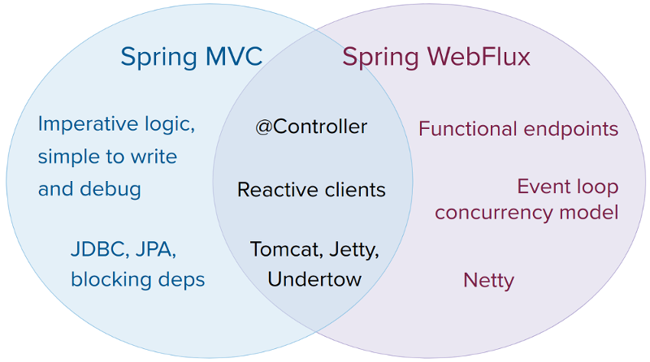

# Introduction to "Reactive" Spring

In this article, I would like to focus on some common phrases related 
to **reactive programming**. Show how new **Spring Webflux** fits in and check 
how much faster we can perform rest queries using new **WebClient** instead 
of traditional **RestTemplate**. 

### **What is reactive programming?**

Reactive programming is a programming paradigm that can be simple described as
* **asynchronous**
* **non-blocking**
* **event-driven**

approach to data processing. Another key aspect of that concept is

* **back pressure**

It means that the producing end of the stream understands how much data 
the consuming end is capable of receiving, and is able to adjust its 
throughput accordingly. 

### **What are blocking and non-blocking requests**

**Traditional MVC applications** use

* thread per request model

Which means that for every incoming request servlet container assigns
a new thread. If request require I/O operations, such as database access,
it will be blocked until operation finished. It is called synchronous 
request processing.

**In non-blocking or asynchronous request processing**, no thread is in 
waiting state. There is generally only 

* one request thread receiving the request

All incoming requests come with a event handler and call back information. 
Request thread delegates the incoming requests to a thread pool 
which delegate the request to it’s handler function and immediately 
start processing other incoming requests from request thread. 
When the handler function is complete, one of thread from pool collect 
the response and pass it to the call back function.


### **What are reactive streams**

Reactive Streams is an initiative to provide a standard for asynchronous 
stream processing with non-blocking back pressure. For programmers, 
Reactive Streams is an API. Two popular implementations of Reactive 
Streams are 
* **RxJava** 
* **Project Reactor**, which is used by default in Spring Webflux

We can see the details of Reactive Streams API below:


### **What is Spring Webflux**

Spring WebFlux is full reactive stack web framework, positioned as a successor
of well-known Spring MVC. Advantages over traditional MVC approach are:
* **a non-blocking approach** which means that very small number of threads can be used
* **functional programming**, which allows to write declarative code with the usage of fluent APIs.

The most important new features are:
* **functional endpoints**
* **event loop concurrency model**
* **reactive Netty server**



Spring webflux uses **project reactor** as reactive library, which provides
two publishers:
* **Mono**: Returns 0 or 1 element.
```java
Mono<String> mono = Mono.just("Peter");
Mono<String> mono = Mono.empty();
```
* **Flux**: Returns 0…N elements.
```java
Flux<String> flux = Flux.just("A", "B", "C");
Flux<String> flux = Flux.fromArray(new String[]{"A", "B", "C"});
Flux<String> flux = Flux.fromIterable(Arrays.asList("A", "B", "C"));
```

### Spring Webflux module

**Spring Framework 5** adds a new **spring-web-reactive** module that supports the 
same **@Controller** programming model as **Spring MVC** but executed on a 
reactive, non-blocking engine. The diagram below shows how Spring MVC 
and Spring Web Reactive compare side by side:


Spring Web Reactive makes use of **Servlet 3.1** non-blocking I/O and runs 
on Servlet 3.1 containers. It also runs on non-Servlet runtimes such as 
**Netty** and **Undertow**. Each runtime is adapted to a set of shared, reactive 
ServerHttpRequest and ServerHttpResponse abstractions that expose the 
request and response body as Flux<DataBuffer> with full backpressure 
support on the read and the write side.

The spring-core module provides reactive **Encoder** and **Decoder** contracts 
that enable the serialization of a **Flux** of bytes to and from typed objects. 
The spring-web module adds JSON (Jackson) and XML (JAXB) implementations for 
use in web applications as well as others for SSE streaming and zero-copy 
file transfer.
[]()
The **spring-web-reactive** module contains the Spring Web Reactive framework 
that supports the @Controller programming model. It re-defines many of the 
Spring MVC contracts such as **HandlerMapping** and **HandlerAdapter** to be 
asynchronous and non-blocking and to operate on the reactive HTTP 
request and response. For this reason Spring MVC and Spring Web Reactive 
cannot share any code. However they do share many of the same algorithms.

##### Spring stack comparison for MVC and WebFlux


### **Spring WebClient vs RestTemplate comparison**

To see what is the real difference in performance between MVC rest client
and Webflux rest client I created application that contains two modules.
Every module is a separate Spring Boot application. First acts as a
server with data, provides rest endpoints and every response is delayed by 2 
seconds to imitate I/O operation. The second acts as rest client and using
RestTemplate and WebClient. Below specifics of both modules. 

#### Server app

1. **Maven POM**
```
<?xml version="1.0" encoding="UTF-8"?>
<project xmlns="http://maven.apache.org/POM/4.0.0" xmlns:xsi="http://www.w3.org/2001/XMLSchema-instance"
         xsi:schemaLocation="http://maven.apache.org/POM/4.0.0 https://maven.apache.org/xsd/maven-4.0.0.xsd">
    <modelVersion>4.0.0</modelVersion>
    <parent>
        <groupId>org.springframework.boot</groupId>
        <artifactId>spring-boot-starter-parent</artifactId>
        <version>2.2.4.RELEASE</version>
        <relativePath/> <!-- lookup parent from repository -->
    </parent>
    <groupId>demo.webflux</groupId>
    <artifactId>server</artifactId>
    <version>0.0.1-SNAPSHOT</version>
    <name>server</name>
    <description>Server app for Webflux demo</description>

    <properties>
        <java.version>11</java.version>
    </properties>

    <dependencies>
        <dependency>
            <groupId>org.springframework.boot</groupId>
            <artifactId>spring-boot-starter-web</artifactId>
        </dependency>

        <dependency>
            <groupId>org.projectlombok</groupId>
            <artifactId>lombok</artifactId>
            <version>1.18.10</version>
            <scope>provided</scope>
        </dependency>

        <dependency>
            <groupId>org.springframework.boot</groupId>
            <artifactId>spring-boot-starter-test</artifactId>
            <scope>test</scope>
            <exclusions>
                <exclusion>
                    <groupId>org.junit.vintage</groupId>
                    <artifactId>junit-vintage-engine</artifactId>
                </exclusion>
            </exclusions>
        </dependency>
    </dependencies>

    <build>
        <plugins>
            <plugin>
                <groupId>org.springframework.boot</groupId>
                <artifactId>spring-boot-maven-plugin</artifactId>
            </plugin>
        </plugins>
    </build>

</project>
```

2. **DataLoader**
```java
package demo.webflux.server.runner;

import demo.webflux.server.entity.Motorcycle;
import demo.webflux.server.entity.Specification;
import demo.webflux.server.repository.MotorcycleDao;
import org.springframework.beans.factory.annotation.Autowired;
import org.springframework.boot.CommandLineRunner;
import org.springframework.stereotype.Component;

import java.util.HashMap;
import java.util.Map;

@Component
public class DataLoader implements CommandLineRunner {

    private static final Map<String, Motorcycle> motorcycleMap = new HashMap<>();

    static {
        motorcycleMap.put("1", new Motorcycle("1", "Suzuki", "Bandit 650",
                new Specification(2000, "red", 6500)));
        motorcycleMap.put("2", new Motorcycle("2", "Suzuki", "V-Strom 650",
                new Specification(2005, "black", 15500)));
        motorcycleMap.put("3", new Motorcycle("3", "Honda", "Varadero 1000",
                new Specification(2002, "blue", 7200)));
        motorcycleMap.put("4", new Motorcycle("4", "Kawasaki", "Vulcan 900",
                new Specification(1997, "green", 12000)));
    }

    @Autowired
    private MotorcycleDao motorcycleDao;

    @Override
    public void run(String... args) throws Exception {
        motorcycleDao.put(motorcycleMap);
    }
}
```

3. **Motorcycle**
```java
package demo.webflux.server.entity;

import lombok.*;

@Setter
@Getter
@AllArgsConstructor
@NoArgsConstructor
@ToString
public class Motorcycle {

    private String id;

    private String make;

    private String model;

    private Specification specs;
}
```

4. **Specification**
```java
package demo.webflux.server.entity;

import lombok.*;

@Getter
@Setter
@ToString
@AllArgsConstructor
@NoArgsConstructor
public class Specification {

    private int year;

    private String colour;

    private double price;
}
```

5. **MotorcycleDao**
```java
package demo.webflux.server.repository;

import demo.webflux.server.entity.Motorcycle;
import org.springframework.stereotype.Component;

import java.util.ArrayList;
import java.util.HashMap;
import java.util.List;
import java.util.Map;

@Component
public class MotorcycleDao {

    private Map<String, Motorcycle> motorcycleMap = new HashMap<>();

    public void put(Map<String, Motorcycle> motorcycles) {
        this.motorcycleMap = motorcycles;
    }

    public Motorcycle get(String id) {
        return motorcycleMap.get(id);
    }

    public List<Motorcycle> getAll() {
        return new ArrayList<>(motorcycleMap.values());
    }
}
```

6. **MotorcycleController**
```java
package demo.webflux.server.controller;

import demo.webflux.server.entity.Motorcycle;
import demo.webflux.server.entity.Specification;
import demo.webflux.server.repository.MotorcycleDao;
import org.slf4j.Logger;
import org.slf4j.LoggerFactory;
import org.springframework.beans.factory.annotation.Autowired;
import org.springframework.web.bind.annotation.GetMapping;
import org.springframework.web.bind.annotation.PathVariable;
import org.springframework.web.bind.annotation.RestController;
import org.springframework.web.servlet.mvc.method.annotation.SseEmitter;

import java.util.concurrent.ExecutorService;
import java.util.concurrent.Executors;

@RestController
public class MotorcycleController {

    private static final Logger logger = LoggerFactory.getLogger(MotorcycleController.class);

    private ExecutorService nonBlockingService = Executors.newCachedThreadPool();

    private MotorcycleDao motorcycleDao;

    @Autowired
    public MotorcycleController(MotorcycleDao motorcycleDao) {
        this.motorcycleDao = motorcycleDao;
    }

    @GetMapping(value = "/motorcycle/{id}", produces = "application/json")
    public Motorcycle getMotorcycle(@PathVariable String id) throws InterruptedException {
        Thread.sleep(2000L);

        logger.debug("Request for motorcycle data, id: " + id);
        return motorcycleDao.get(id);
    }

    @GetMapping(value = "/motorcycle/{id}/specification", produces = "application/json")
    public Specification getSpecification(@PathVariable String id) throws InterruptedException {
        Thread.sleep(2000L);

        logger.debug("Request for specification for motorcycle id: " + id);
        return motorcycleDao.get(id).getSpecs();
    }

    @GetMapping(value = "/motorcycles/stream", produces = "application/json+stream")
    public SseEmitter motorcycleSseStream() {
        SseEmitter emitter = new SseEmitter();
        nonBlockingService.execute(() -> {
            try {
                for (Motorcycle moto: motorcycleDao.getAll()) {
                    Thread.sleep(2000L);
                    emitter.send(moto);
                }
                emitter.complete();
            } catch (Exception ex) {
                emitter.completeWithError(ex);
            }
        });
        return emitter;
    }
}
```

7. **ServerApplication**
```java
package demo.webflux.server;

import org.springframework.boot.SpringApplication;
import org.springframework.boot.autoconfigure.SpringBootApplication;

@SpringBootApplication
public class ServerApplication {

    public static void main(String[] args) {
        SpringApplication.run(ServerApplication.class, args);
    }
}

```

8. application.properties
```
server.port=8081
logging.level.org.springframework.web: DEBUG
logging.level.demo.webflux.server: DEBUG
```

#### Client App

1. **Maven POM**
```
<?xml version="1.0" encoding="UTF-8"?>
<project xmlns="http://maven.apache.org/POM/4.0.0" xmlns:xsi="http://www.w3.org/2001/XMLSchema-instance"
         xsi:schemaLocation="http://maven.apache.org/POM/4.0.0 https://maven.apache.org/xsd/maven-4.0.0.xsd">
    <modelVersion>4.0.0</modelVersion>
    <parent>
        <groupId>org.springframework.boot</groupId>
        <artifactId>spring-boot-starter-parent</artifactId>
        <version>2.2.4.RELEASE</version>
        <relativePath/> <!-- lookup parent from repository -->
    </parent>
    <groupId>demo.webflux</groupId>
    <artifactId>client</artifactId>
    <version>0.0.1-SNAPSHOT</version>
    <name>client</name>
    <description>Client app for Webflux demo</description>

    <properties>
        <java.version>11</java.version>
    </properties>

    <dependencies>
        <dependency>
            <groupId>org.springframework.boot</groupId>
            <artifactId>spring-boot-starter-webflux</artifactId>
        </dependency>

        <dependency>
            <groupId>org.springframework.boot</groupId>
            <artifactId>spring-boot-starter-test</artifactId>
            <scope>test</scope>
            <exclusions>
                <exclusion>
                    <groupId>org.junit.vintage</groupId>
                    <artifactId>junit-vintage-engine</artifactId>
                </exclusion>
            </exclusions>
        </dependency>
        <dependency>
            <groupId>io.projectreactor</groupId>
            <artifactId>reactor-test</artifactId>
            <scope>test</scope>
        </dependency>
        <dependency>
            <groupId>demo.webflux</groupId>
            <artifactId>server</artifactId>
            <version>0.0.1-SNAPSHOT</version>
            <scope>compile</scope>
        </dependency>
    </dependencies>

    <build>
        <plugins>
            <plugin>
                <groupId>org.springframework.boot</groupId>
                <artifactId>spring-boot-maven-plugin</artifactId>
            </plugin>
        </plugins>
    </build>

</project>
```

2. **ClientApplication**
```java
package demo.webflux.client;

import demo.webflux.server.entity.Motorcycle;
import demo.webflux.server.entity.Specification;
import org.slf4j.Logger;
import org.slf4j.LoggerFactory;
import org.springframework.boot.SpringApplication;
import org.springframework.boot.autoconfigure.SpringBootApplication;
import org.springframework.http.HttpStatus;
import org.springframework.web.client.RestTemplate;
import org.springframework.web.reactive.function.client.WebClient;
import org.springframework.web.util.DefaultUriBuilderFactory;
import reactor.core.publisher.Flux;

import java.time.Duration;
import java.time.Instant;
import java.util.stream.Stream;

/**
 * First start Server APP before running Client APP
 */
@SpringBootApplication
public class ClientApplication {

    private static final Logger logger = LoggerFactory.getLogger(ClientApplication.class);

    private static final String serverUrl = "http://localhost:8081";

    private static WebClient client = WebClient.create(serverUrl);

    private static RestTemplate restTemplate = new RestTemplate();

    static {
        restTemplate.setUriTemplateHandler(new DefaultUriBuilderFactory(serverUrl));
    }

    public static void main(String[] args) {
        SpringApplication.run(ClientApplication.class, args);

//        restTemplateApproach();
        webClientApproach();
    }

    private static void webClientApproach() {
        Instant start = Instant.now();

//        retrieveExample();
//        exchangeExample();
//        nestedRequest();
        streamRequest();

        logTime(start);
    }

    private static void restTemplateApproach() {
        Instant start = Instant.now();

        singleRequestByRestTemplate();
        nestedRequestByRestTemplate();

        logTime(start);
    }

    private static void singleRequestByRestTemplate() {
        Stream.iterate(1, n -> n + 1)
                .limit(4)
                .forEach(n -> restTemplate.getForObject("/motorcycle/{id}", Motorcycle.class, n));
    }

    private static void nestedRequestByRestTemplate() {
        Stream.iterate(1, n -> n + 1)
                .limit(4)
                .forEach(n -> {
                    Motorcycle moto = restTemplate.getForObject("/motorcycle/{id}", Motorcycle.class, n);
                    restTemplate.getForObject("/motorcycle/{id}/specification", Specification.class, moto.getId());
                });
    }


    private static void retrieveExample() {
        Flux.range(1, 4)
                .flatMap(i -> client.get().uri("/motorcycle/{id}", i)
                        .retrieve()
                        .bodyToMono(Motorcycle.class))
                .blockLast();
    }

    private static void exchangeExample() {
        Flux.range(1, 4)
                .flatMap(i ->
                        client.get()
                                .uri("/motorcycle/{id}", i)
                                .exchange()
                                .flatMap(response -> {
                                    if (response.statusCode() == HttpStatus.OK) {
                                        return response.bodyToMono(Motorcycle.class);
                                    } else {
                                        return response.releaseBody();
                                    }
                                }))
                .doOnNext(p -> System.out.println(p))
                .blockLast();
    }

    private static void streamRequest() {
        client.get().uri("/motorcycles/stream")
                .retrieve()
                .bodyToFlux(Motorcycle.class)
                .take(4)
                .blockLast();
    }

    private static void nestedRequest() {
        Flux.range(1, 4)
                .flatMap(i -> client.get().uri("/motorcycle/{id}", i)
                        .retrieve()
                        .bodyToMono(Motorcycle.class)
                        .flatMap(person -> client.get().uri("/motorcycle/{id}/specification", i)
                                .retrieve()
                                .bodyToMono(Specification.class)))
                .blockLast();
    }

    private static void logTime(Instant start) {
        logger.debug("Elapsed time: " + Duration.between(start, Instant.now()).toMillis() + " ms");
    }

}

```

#### Rest Template synchronous requests


#### Rest Template synchronous requests with nested calls


#### WebClient asynchronous requests


#### WebClient asynchronous requests with nested calls


#### Notes

As we can see from the above, very simple measurements, queries using 
WebClient are over three times faster than using RestTemplate. The goal
of this application is not to perform heavy testing but rather to show the 
possibilities that lie in **reactive programming** and **Spring WebFlux**
To show the simplicity of declarative requests that are asynchronous, 
non-blocking and event-driven.

### Summary

Reactive Programming is definitely an interesting approach to developing 
web applications today. Of course it does not fit all scenarios. But, where it 
is a good fit, for example streaming application, it can boost performance 
very easily as oppose to traditional MVC approach.
What's more with new Spring 5 and its event loop concurrency model we can
write applications which are very easy to scale under heavy load.

##### Download

You can download the code from my github repository:

[Download from github repository](https://github.com/skurski/webflux-project.git)

##### Sources

[https://docs.spring.io/spring/docs/current/spring-framework-reference/web-reactive.html](https://docs.spring.io/spring/docs/current/spring-framework-reference/web-reactive.html)

[YouTube - "Guide to "Reactive" for Spring MVC Developers](https://youtu.be/IZ2SoXUiS7M)

[https://howtodoinjava.com/spring-webflux/spring-webflux-tutorial/](https://howtodoinjava.com/spring-webflux/spring-webflux-tutorial/)

[https://www.reactive-streams.org/](https://www.reactive-streams.org/)

